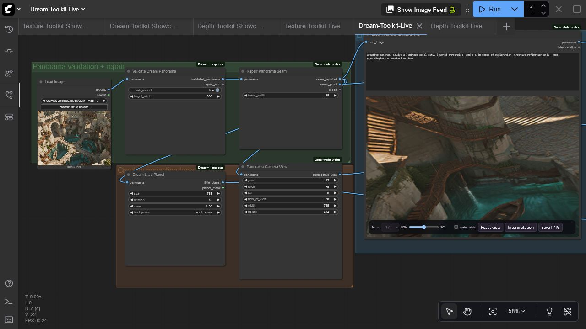

# ComfyUI Dream Interpreter

An offline panorama, creative-reflection, and visual-journaling toolkit for ComfyUI. It validates and repairs equirectangular images, creates camera views and little planets, explores panoramas interactively, and structures creative notes without making psychological or medical claims.



## Nodes

| Node | Purpose | Outputs |
| --- | --- | --- |
| **Dream Panorama Viewer Pro** | Interactive 360° WebGL panorama with interpretation panel | panorama + interpretation passthrough |
| **Validate Dream Panorama** | Inspect 2:1 geometry and optionally repair resolution/aspect | panorama + JSON report |
| **Repair Panorama Seam** | Blend the equirectangular wrap seam and provide a magnified proof | repaired panorama, proof, report |
| **Panorama Camera View** | Deterministic equirectangular-to-perspective projection | IMAGE |
| **Dream Little Planet** | Stereographic little-planet projection | IMAGE + MASK |
| **Dream Prompt Builder** | Create a panorama/image prompt, negative prompt, and structured brief | strings/JSON |
| **Dream Motif Tags** | Deterministic descriptive motif extraction | tags + JSON report |
| **Dream Journal Entry** | Build Markdown/JSON journal records and optionally save under ComfyUI output | text, JSON, saved path |

## Viewer highlights

- Smooth orbit, zoom, adjustable field of view, optional auto-rotation, and reset
- Batch panorama selector and per-run interpretation panel
- PNG capture
- Reduced-motion support, lazy/offscreen rendering, stale-load cancellation, texture disposal, and WebGL context recovery
- Local pinned Three.js r185 assets with no CDN dependency or telemetry

## Install

Install with ComfyUI Manager, or clone manually:

```bash
cd ComfyUI/custom_nodes
git clone https://github.com/gokayfem/ComfyUI-Dream-Interpreter.git
python -m pip install -r ComfyUI-Dream-Interpreter/requirements.txt
```

Restart ComfyUI. Nodes are under `visualization/3D` and `dream/panorama`.

## Start with the live example

Load [`examples/workflows/Dream-Toolkit-Live.json`](examples/workflows/Dream-Toolkit-Live.json), choose an image, and queue it. The graph validates the panorama, repairs its seam, renders a perspective camera view and little planet, and opens the live 360° viewer. The API-format version is [`examples/api/dream_toolkit_api.json`](examples/api/dream_toolkit_api.json).

For best panorama results, begin with a true 2:1 equirectangular image. **Validate Dream Panorama** can repair dimensions, but it cannot invent missing 360° scene content.

## Responsible use

The text utilities are creative organization tools. Motif labels are descriptive keyword matches, not diagnoses or authoritative interpretations. The included prompt/report outputs explicitly preserve this non-clinical boundary. Journal saving is confined to the active ComfyUI output directory and rejects path traversal.

## Compatibility and performance

- Python 3.10+; tested in CI on Linux, Windows, and macOS
- Real ComfyUI test: ComfyUI 0.3.60, frontend 1.26.13, Windows, NVIDIA RTX 3090
- Projection and text utilities are deterministic CPU operations; the panorama preview uses the browser's WebGL implementation and works independently of CUDA/ROCm/MPS
- No runtime network requests; images and journal data remain local

## Development

```bash
python -m pip install -r requirements.txt pytest build
python -m compileall -q .
pytest -q
python -m build
node --check web/viewer_extension_3_0.js
node --check web/js/threeVisualizer.mjs
```

The vendored Three.js files are MIT licensed; see `web/vendor/THREE-LICENSE.txt`. See [`SECURITY.md`](SECURITY.md) for privacy and disclosure guidance.

<details>
<summary><strong>Cite this project</strong></summary>

If ComfyUI Dream Interpreter supports your work, GitHub provides ready-to-copy
APA and BibTeX entries via **Cite this repository**.

```bibtex
@software{Aydogan_ComfyUI_Dream_Interpreter_2026,
  author  = {Aydoğan, Gökay},
  title   = {ComfyUI Dream Interpreter},
  version = {3.0.0},
  year    = {2026},
  url     = {https://github.com/gokayfem/ComfyUI-Dream-Interpreter}
}
```

[ORCID](https://orcid.org/0000-0002-2343-9433) · [Citation metadata](CITATION.cff)

</details>

## Acknowledgements

The original viewer was inspired by
[ComfyUI-Flowty-TripoSR](https://github.com/flowtyone/ComfyUI-Flowty-TripoSR).
